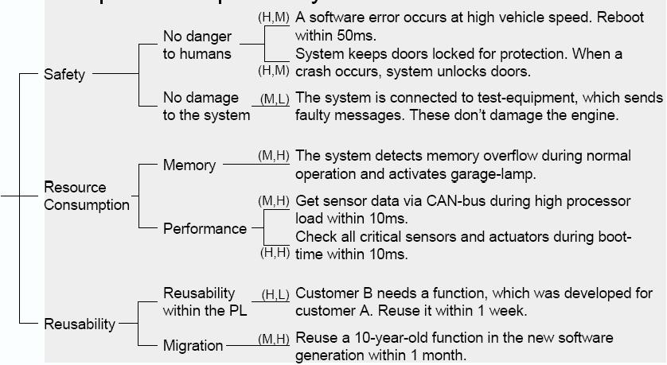

There is no good or bad solution architecture in general. Architecture can just more or less fit for the purpose it was designed for. And if the particular architecture fits a customer needs so we can say that this solution architecture is good. So the bottom line is - you can evaluate solution architecture only in the context of particular declared goals.

# Solution Architecture Quality
The goal is to convert all Functional Requirements (FR), NFR, Constraints, Assumptions to Quality Attributes. More importantly, you should define measurable metrics for those quality attributes.

A quality attribute is a measurable or testable property of the system that is used to indicate how well the system satisfies the needs of its stakeholders.
|                  |Microsoft           |Len Bass, Raul Clements, Rick Kazman    |
|------------------|--------------------|----------------------------------------|
|                  |                    |                                        |
|Design Qualitites |Conceptual Integrity|Conceptual Integrity                    |
|                  |Maintanability      |Maintanability, Variability, Portability|
|                  |Reusability         |                                        |
|                  |                    |                                        |
|Run-time Qualities|Availability        |Availability                            |
|                  |Managebility        |Monitorability                          |
|                  |Performance         |Performance                             |
|                  |Reliability         |Reliability.                            |
|                  |Scalability         |Scalability                             |
|                  |Security            |Security                                |
|                  |                    |                                        |
|System Qualities  |Supportability      |                                        |
|                  |                    |Development Distributability            |
|                  |                    |Deployability                           |
|                  |                    |Mobility                                |
|                  |Testability         |Testability                             |
|                  |                    |                                        |
|User Qualities    |Usability           |Usability                               |
|                  |                    |Safety                                  |

Example: measure Availability - It the proportion of time that the system is functional and working (a percentage of the total system downtime over a predefined period).
Metrics:
- availability percentage (e.g 99.99%)
- Time to detect the fault
- Time to repair the fault
- Time or time interval in which system can be in degraded mode
- Proportion (e.g. 99%) or rate (e.g. up to 100 per second) of a certain class of fault that the system prevents, or handles without failing
- etc.

Example: measuring Performance - An indication of the responsiveness of a system to execute any action within a given time interval (latency or throughput).
Metrics:
- Latency (time take to respond to any event)
- Throughput (number of events that take place within a given amount of time)
- Jitter
- Miss rate
- etc.

# Architecture Significant Requirements (ASR)
This kind of requirement has a profound effect on architecture. ASR can be collected from FR, NFR, Interviewing Stakeholders, by understanding Business Goals, by conduction Quality Attribute workshops. Based on this document you should create a Utility Tree with ASRs.

[Utility Tree gathering process in details](https://arnon.me/2010/05/utility-trees-hatching-quality-attributes)
