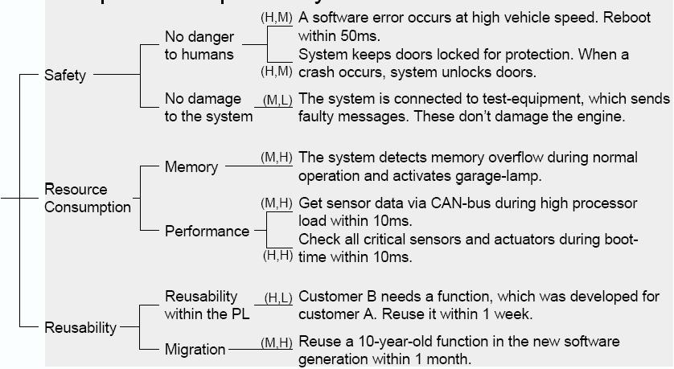
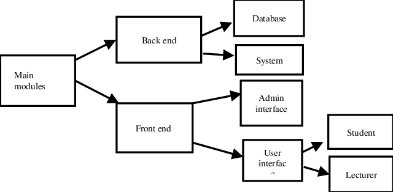
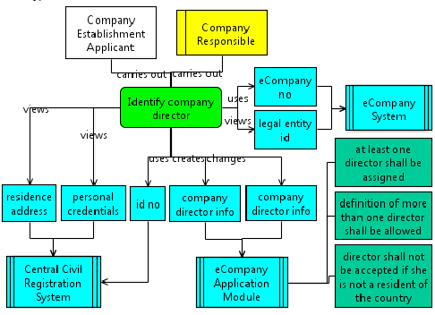
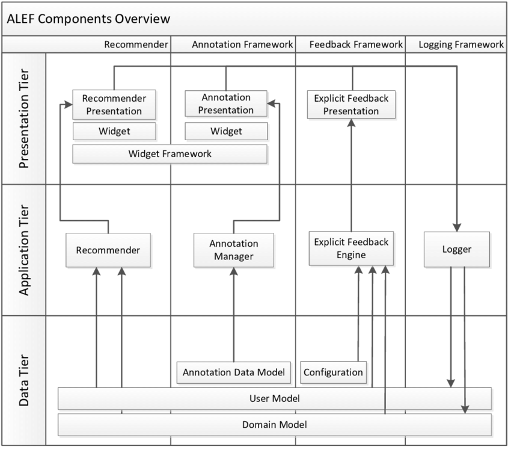

There is no good or bad solution architecture in general. Architecture can just more or less fit for the purpose it was designed for. And if the particular architecture fits a customer needs so we can say that this solution architecture is good. So the bottom line is - you can evaluate solution architecture only in the context of particular declared goals.

# Solution Architecture Quality Attributes
The goal is to convert all Functional Requirements (FR), NFR, Constraints, Assumptions to Quality Attributes. More importantly, you should define measurable metrics for those quality attributes.

A quality attribute is a measurable or testable property of the system that is used to indicate how well the system satisfies the needs of its stakeholders.

|Category          |Microsoft           |Len Bass, Raul Clements, Rick Kazman    |Measurable metrics (the list need to be updated)               |
|------------------|--------------------|----------------------------------------|---------------------------------------------------------------|
|                  |                    |                                        |                                                               |
|Design Qualitites |Conceptual Integrity|Conceptual Integrity                    |[Conceptual Integrity metrics](metrics/conceptual-integrity.md)|
|                  |Maintanability      |Maintanability, Variability, Portability|[Maintainability metrics](metrics/maintainability.md)          |
|                  |Reusability         |                                        |[Re-usability metrics](metrics/re-usability.md)                |
|                  |                    |                                        |                                                               |
|Run-time Qualities|Availability        |Availability                            |[Availability metrics](metrics/availability.md)                |
|                  |Managebility        |Monitorability                          |[Manageability metrics](metrics/managebility.md)               |
|                  |Interoperability    |Interoperability                        |[Interoperability metrics](metrics/interoperability.md)        |
|                  |Performance         |Performance                             |                  |
|                  |Reliability         |Reliability.                            |                  |
|                  |Scalability         |Scalability                             |                  |
|                  |Security            |Security                                |                  |
|                  |                    |                                        |                  |
|System Qualities  |Supportability      |                                        |                  |
|                  |                    |Development Distributability            |                  |
|                  |                    |Deployability                           |                  |
|                  |                    |Mobility                                |                  |
|                  |Testability         |Testability                             |                  |
|                  |Auditability        |Auditability                            |                  |
|                  |                    |                                        |                  |
|User Qualities    |Usability           |Usability                               |                  |
|                  |                    |Safety                                  |                  |
|                  |Accessibility       |Accessibility                           |                  |

Example: measure Availability - It the proportion of time that the system is functional and working (a percentage of the total system downtime over a predefined period).
Metrics:
- availability percentage (e.g 99.99%)
- Time to detect the fault
- Time to repair the fault
- Time or time interval in which system can be in degraded mode
- Proportion (e.g. 99%) or rate (e.g. up to 100 per second) of a certain class of fault that the system prevents, or handles without failing
- etc.

Example: measuring Performance - An indication of the responsiveness of a system to execute any action within a given time interval (latency or throughput).
Metrics:
- Latency (time take to respond to any event)
- Throughput (number of events that take place within a given amount of time)
- Jitter
- Miss rate
- etc.

# Architecture Significant Requirements
This kind of requirement has a profound effect on architecture. ASR can be collected from FR, NFR, Interviewing Stakeholders, by understanding Business Goals, by conduction Quality Attribute workshops. Based on this document you should create a Utility Tree with ASRs.

[Utility Tree gathering process in details](https://arnon.me/2010/05/utility-trees-hatching-quality-attributes)

# Current Architecture
This part must be implemented after you have all requirements and you have already analyzed them. This phase consists of the parts:
- High-level solution structure
- Structure of the solution components and their technology stacks
- High-level deployment approach
- Solution cross-cutting concerns

#### High-level solution structure
High-level solution structure - SEI has the recommendation to document it with one or multiple the next views: Module style, Component-and-connector style, Allocation style, Combined-style, and any other notations. 
This is a high-level map of the solution. The layers can be used for introduction tiers.
All solution components must be shown: services, applications by nature, data storages, buses, caches and etc.

In a diagram can be described the next:
- solution components
- 

###### module style diagram [source](https://www.researchgate.net/figure/Module-Diagram-of-the-System_fig2_331662435)

###### Component-and-connectors style diagram [source](https://www.uml-diagrams.org/component-diagrams.html)

###### Allocation style diagram [source](https://www.researchgate.net/figure/Example-Function-Allocation-FA-Diagram_fig1_301351430)

###### Combined style diagram [source](https://www.researchgate.net/figure/ALEF-components-overview-three-tiers-architecture-data-application-and-presentation_fig5_283412581)
 

#### Structure of the solution components and their technology stacks
Can be represented as a table under a component diagram with the list of components and technology stack used for those components

|Description                    |Linux application running on a server that ... bla bla       |
|-------------------------------|-------------------------------------------------------------|
|Technology stack               |Flutter Dart                                                 |
|Related Components             |Database                                                     |
|Covered functional requirements|Shows users list                                             |
|Notes                          |                                                             |

#### High-level deployment approach
It might be implemented in different ways.
For instance, the deployment plan outlines the scope, approach, and execution planned for the deployment of the project deliverables.
 The plan includes, where relevant, information about system support, issue tracking, escalation processes, roles, and responsibilities before, during, and after deployment.
It can also be described with a deployment diagram.

[source](https://en.wikipedia.org/wiki/Deployment_diagram#/media/File:Deployment_Diagram.PNG)

#### Solution cross-cutting concerns
cross-cutting concerns are aspects of a program that affect other concerns.
These concerns often cannot be cleanly decomposed from the rest of the system in both the design and implementation, and can result in either scattering (code duplication), tangling (significant dependencies between systems), or both.

For instance, if writing an application for handling medical records, the indexing of such records is a core concern, while logging a history of changes to the record database or user database, or an authentication system, would be cross-cutting concerns since they interact with more parts of the program.

//todo add more cross-cutting concerns types

Examples of concerns that tend to be cross-cutting include:
- Availability
- Audition
- Business rules
- Caching
- Code mobility
- Data validation
- Domain-specific optimizations
- Error detection and correction
- Internationalization and localization which includes Language localisation
- Information security
- Logging
- Memory management
- Metrics
- Monitoring
- Persistence
- Product features
- Real-time constraints
- Synchronization
- Security
- Transaction processing
- Context-sensitive help

## Views
SEI recommends using different views for different stakeholders.
For simplicity, you can create a table with a list of stakeholders and diagram view for them.

//todo add more views and examples

|Stakeholder                    |Module view         |Components and connectors | Allocation views     |
|-------------------------------|--------------------|--------------------------|----------------------|
|Product owner                  |Decompositions View |N/A                       | Deployment View      |
|Maintenance engineer           |Decompositions View |N/A                       | Deployment View      |
|End User                       |Shows users list    |N/A                       | N/A                  |
|Developer                      |Class View          |Component View            | Deployment View      |
|QA                             |Decompositions View |N/A                       | Deployment View      |
|PM                             |N/A                 |N/A                       | Work assignment view |
